# Swiggy (Screenshots Of the Build)
### For the sake of learning React and implementing it in with Live Swiggy API. I built a Swiggy-like UI.
### Learnt a lot about Reconciliation Algo, Hooks, custom Hooks, APIs, JSX, Shimmer Effect,

## Removed CSS

## Used Tailwind

## Hover Effect

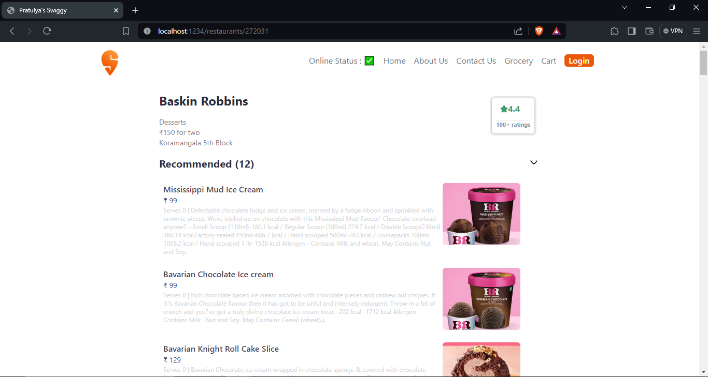

## ADD buttons
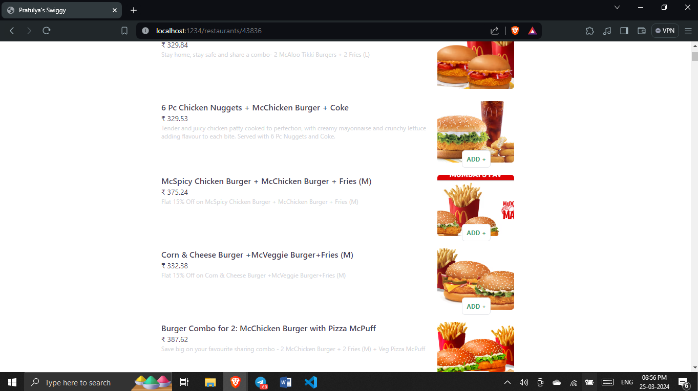

## ACCORDION - used Lifting the state Up theory 
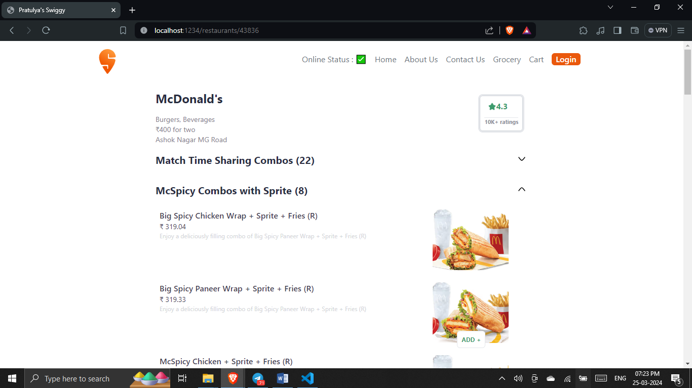 
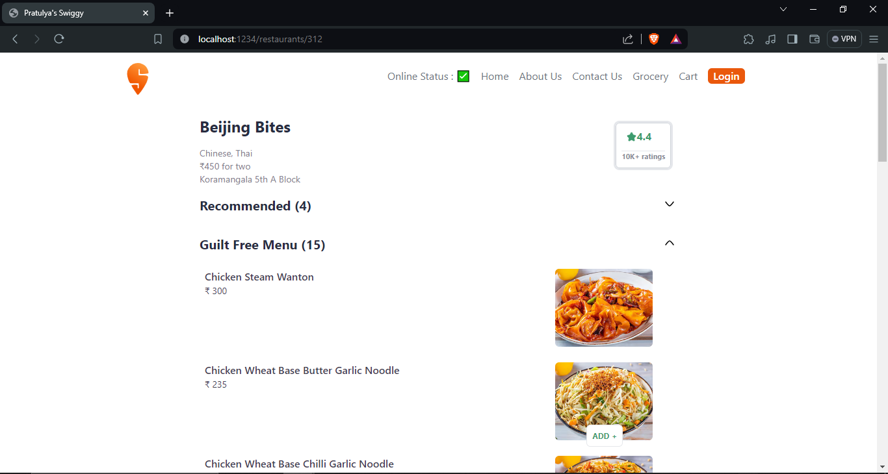

## Concepts of UseContext
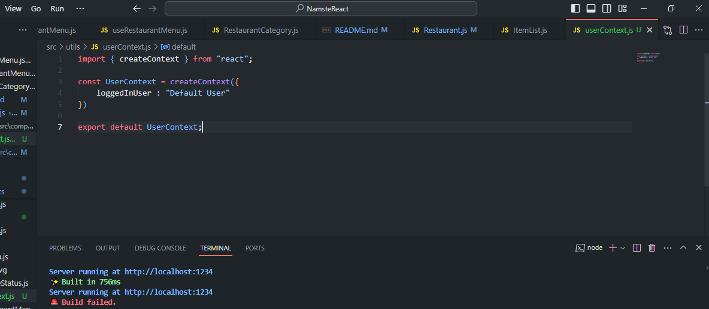
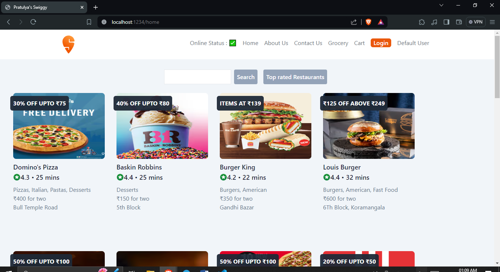
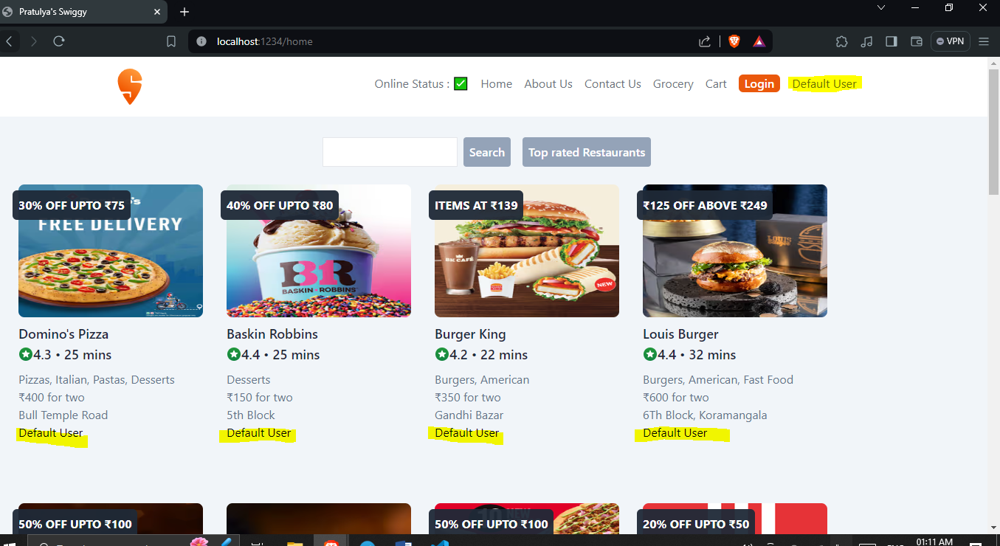

Using in class-based component
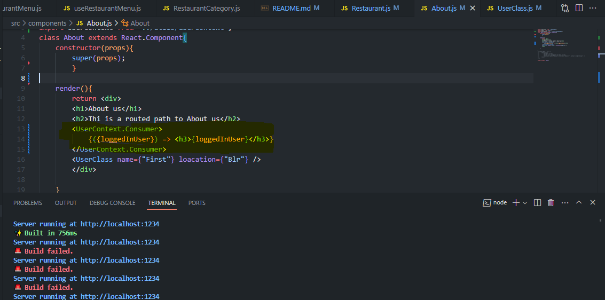

wrapping up under the App. Modifying useContext
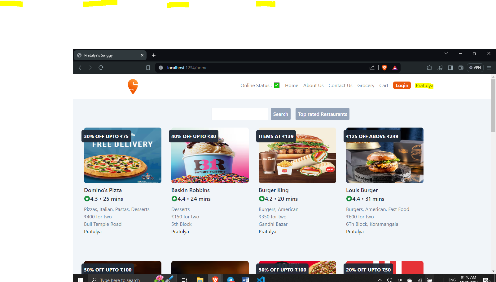

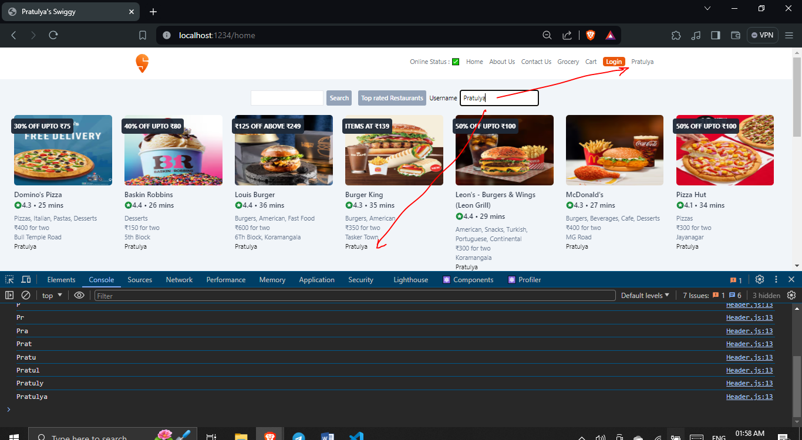

## Redux toolKit to build cart
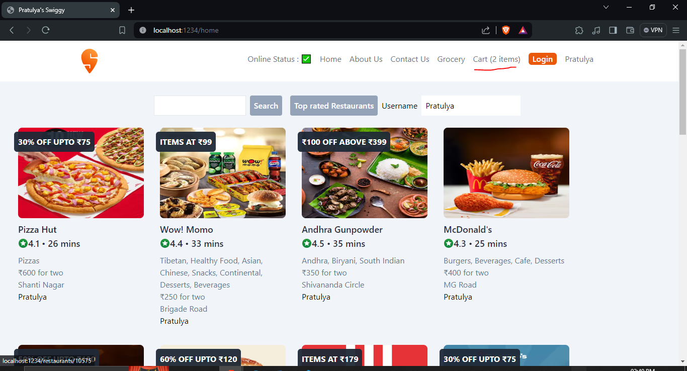
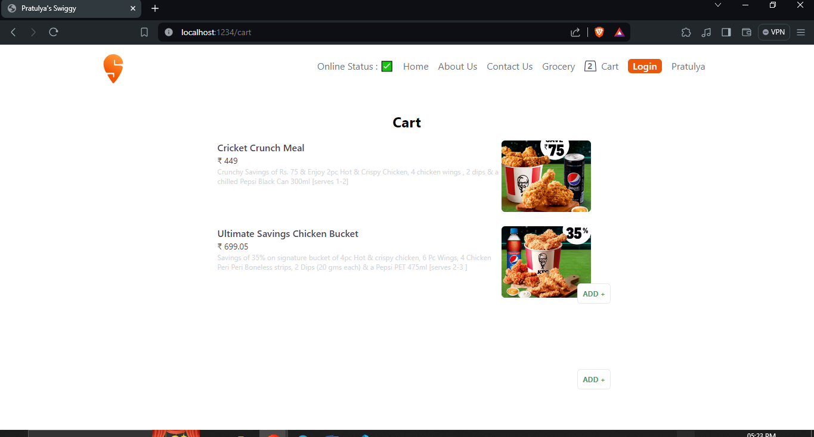

Added Clear cart
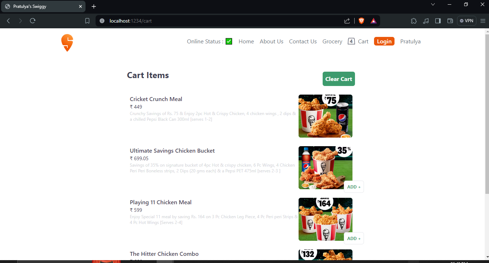
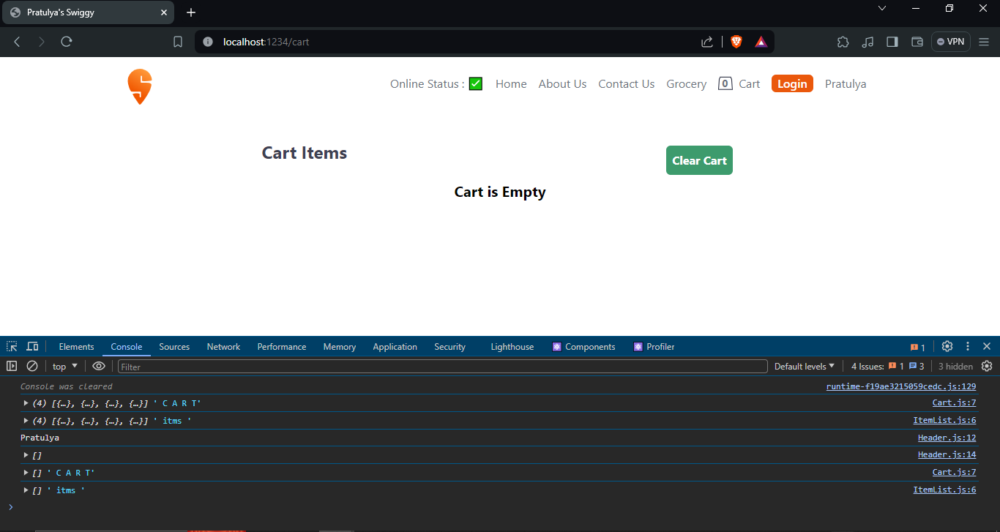
